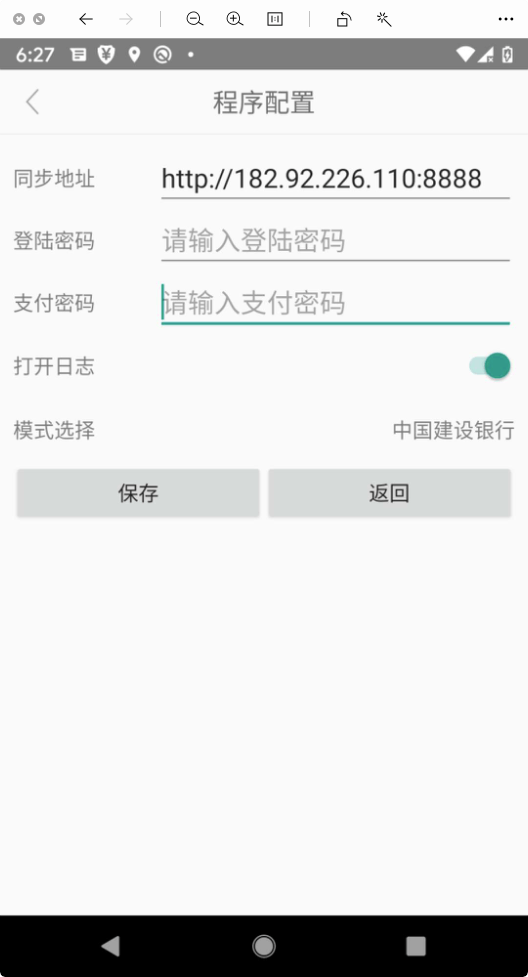
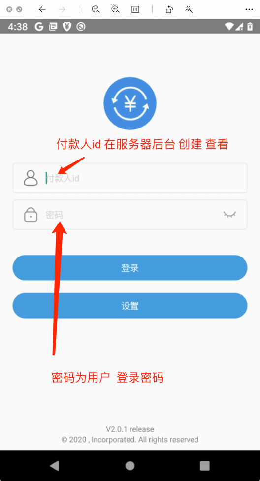

# 支付宝转账 - 手机版

全自动 支付宝转支付宝 安卓手机版本


## 1. 服务器注册账号


```

主页点击 ->  登录/注册

勾选 注册 新账号 

填写信息 点击注册

```
## 2. 登录后台 添加付款人


```
登陆后台

付款人账户 -> 添加   

填写 信息 点击创建


```


## 3. 手机 安装 BankTools 软件  和 支付宝软件
[软件 下载地址](http://106.54.94.71:8848/release/android_Release/)

```
不同版本 在不同目录下  请自行选择 下载 安装

支付宝 或者 银行软件 第一次请自动 登录

建议使用 goole nexus5 、google pixel xl 、华为mate9 、华为畅享9e 
已经测试 通过 
```


## 4. BankTools 工具App 使用
> 1. 进入设置 




```
填写域名 登陆密码   支付密码 开启日志模式  选择需要的模式 

点击保存
```


> 2. 登陆 





```angular2html

填写 付款人id  (在服务器后台付款人 id )  
密码为 服务器后台 用户登录 密码
```


> 3. 检测底层服务是否开启


```
点击用户头像 检测底层服务是否启动

提示 OK 表示启动成

无法启动 联系技术 指导如何启动

```


> 4. 在服务器后台 下单测试


测试 账号填写 支付宝账号


```
正常情况 点击测试 APP会收到消息 

启动 支付宝 或者 银行app

开始 自动转账

完成转账后 会自动回调服务器 

```


## 5. 常见问题

>1. 测试 app 无法收到消息

问题原因   ---  

    mqtt 连接可能存在问题

解决方法   ---  

    1. 检测网络环境是否正常 
    2. 确定是否有其他手机 登录 

>2. 无法自动操作
问题原因   --- 

    权限未开启
    
解决方法   ---  
    
    开启权限

>3. 在最后的确定支付页面  不动了 
    
问题原因   ---  

    1. 底层服务未开启
    2. 手机需要适配
        
解决方法   ---  

    联系客服 或者 技术支持 帮助开启底层服务 或者 手机适配
            


 
## 手机适配
|  手机型号   | 是否支持  | |
|  ----  | ----  |--- |
| goole nexus5  | 支持 | |
| google pixel xl  | 支持 | |
| 华为mate9  | 支持 | |
| 华为畅享9e  | 支持 | |
| oppo R11s  | 支持 | |

如果你的手机 运行存在问题 联系我们 可以帮您适配

手机适配收费 100 - 300


