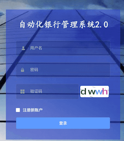

# 建设银行转账 - PC版

全自动 建设银行 PC版本

需要 
1. 建行U盾 
2. windows电脑
3. USB 易键鼠 单头 (自行淘宝购买 7元/个)


## 1. 服务器注册账号



```

主页点击 ->  登录/注册

勾选 注册 新账号 

填写信息 点击注册

```
## 2. 登录后台 添加付款人


```
登陆后台

付款人账户 -> 添加   

填写 信息 点击创建


```


## 3. 在windows 上配置IE

IE浏览器设置配置：

    （1）针对windows vista和windows 7上的IE7或者更高的版本，
    必须在IE选项设置的安全页中，4个区域的启用保护模式的勾选都 都勾上 ，
    即保持四个区域的保护模式是一致的。如下图所示
 
<a href="https://cl.ly/e0cb8ebb20cd" target="_blank"></a>


    （2）针对IE10和更高的版本，必须在IE选项设置中的高级页中，取消增强保护模式。
    如下图所示：
    
<a href="https://cl.ly/1dde9bef4439" target="_blank"></a>

    （3）IE浏览器设置，缩放设置为100%；
    将IE 浏览器切换只小窗户后  拖动拉伸 把浏览器拉伸至最大

<a href="https://cl.ly/84eb9856fa50" target="_blank"></a>  


    （4）IE浏览器设置，删除历史记录  不要勾选 
<a href="https://cl.ly/1f2e42cbdd5b" target="_blank"></a>    
  
  
  
### 4. 调整建设银行
    转账的位置 确保在第二个位置
    
<a href="https://cl.ly/d86aaee3d794" target="_blank"></a>    
    
    
  


## 4.  在windows 安装 BankTools PC版本 软件 
[软件 下载地址](http://106.54.94.71:8848/release/PC_Release/)

```
在 windows 电脑上 下载 安装 BankTools PC版本  

使用 付款人id  登录

```

   
> 4. 在服务器后台 下单测试


测试 账号填写 支付宝账号


```
正常情况 点击测试 PC客户端 会收到消息 

启动 IE 浏览器

开始 自动转账

完成转账后 会自动回调服务器 

```


## 5. 常见问题


>1. 无法启动 IE
问题原因   --- 

    IE 配置 不对 
    
解决方法   ---  
    
    参考IE配置流程 

>2. 无法输入密码 
    
问题原因   ---  
    
    1. USB 易键鼠 为插入
    2. 版本下载错了  系统win7 和 win10 有区别
    
        
解决方法   ---  

    1. 检测是否 插入 USB 易键鼠
    2. 检测自己的  版本是否正确
        
            


 


